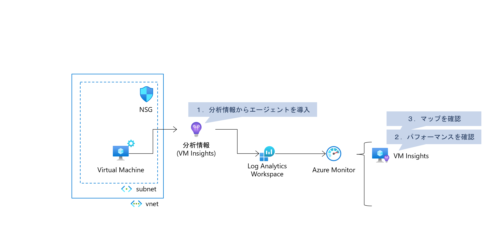
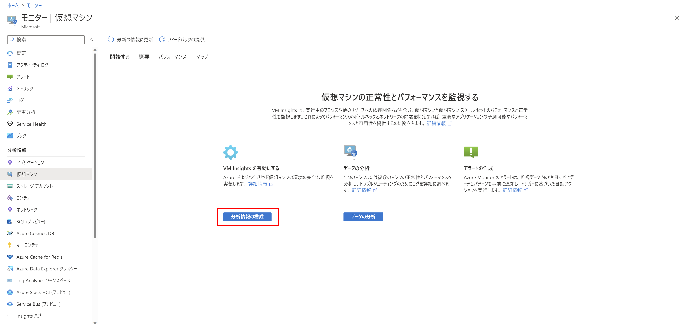
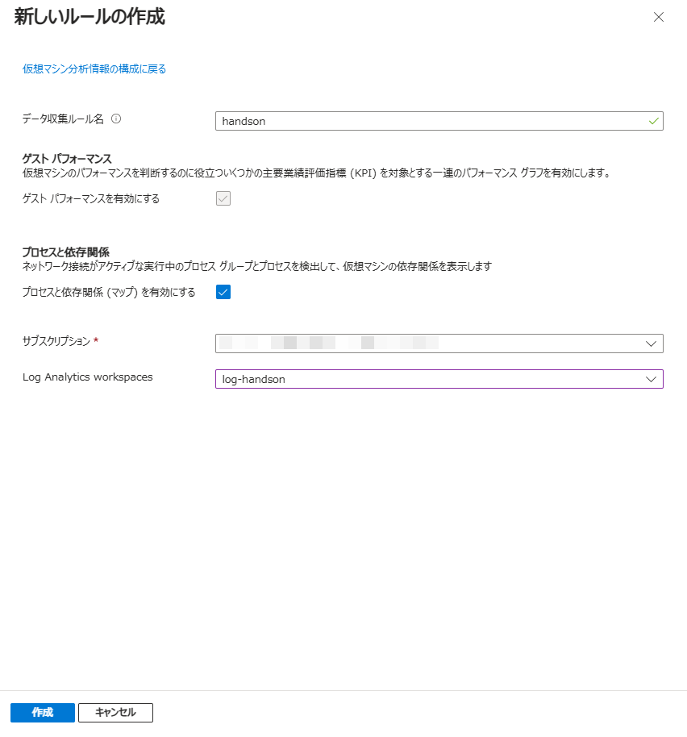
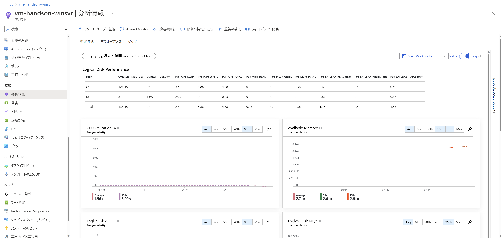
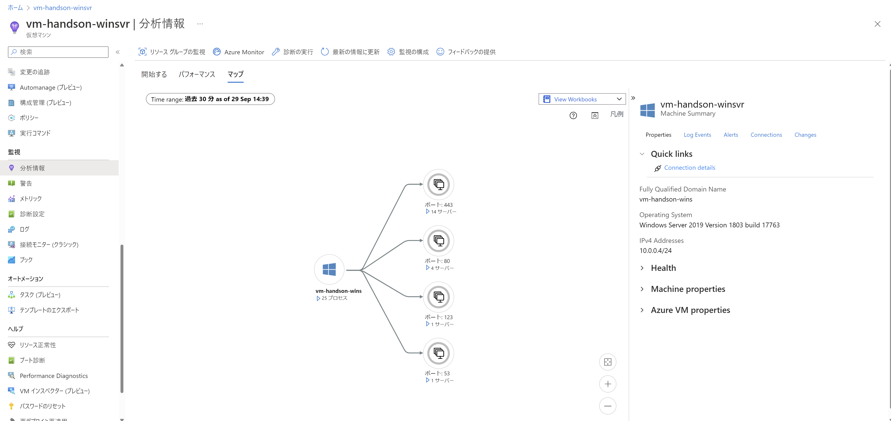

# Exercise2: VM Insights 設定

## 【目次】

1. [分析情報からエージェントを導入](#分析情報からエージェントを導入)
1. [パフォーマンスを確認](#パフォーマンスを確認)
1. [マップを確認](#マップを確認)

## 分析情報からエージェントを導入

1. Azureポータル上部の検索窓で「モニター」を検索、開く

1. [分析情報]-[仮想マシン] を開く

    

1. 「分析情報の構成」を選択

    

1. 環境準備で作成した仮想マシンを探し、「有効にする」を選択

    

1. 「有効」を選択

    

1. 監視の構成

    1. データ収集ルールの「新規作成」を選択

    1. 新しいルールの作成

        * データ収集ルール名： (任意)
        * プロセスと依存関係（マップ）を有効にする： `有効`
        * サブスクリプション： (ハンズオン用に用意したもの)
        * Log Analyrics ワークスペース： (作成済みのLog Analytics ワークスペース)

        

    1. 監視の構成を以下のように設定、「構成」

        * 次を使用した分析情報を有効にする： `Azure Monitor エージェント`
        * サブスクリプション： (ハンズオン用に用意したもの)
        * データ収集ルール： (新規作成から作成したもの)

         

(*) 以下の「パフォーマンス」「マップ」はデータ反映に時間がかかるため、
    確認して表示されていない場合、次の Excersise へ進んであとから確認する

## パフォーマンスを確認

1. Azureポータル上部の検索窓から「Virtual Machines」を検索、開く

1. 一覧から環境準備で作成した仮想マシンを選択

1. [監視]-[分析情報] を開く

1. 「パフォーマンス」タブへ移動して、パフォーマンスを確認

    CPU, メモリ, Disk I/O など確認

    

## マップを確認

1. Azureポータル上部の検索窓から「Virtual Machines」を検索、開く

1. 一覧から環境準備で作成した仮想マシンを選択

1. [監視]-[分析情報] を開く

1. 「マップ」タブへ移動して、マップを確認

    仮想マシンの中で動作しているプロセス、各プロセスがどこへアクセスしているのか、が確認できる

    

# 次の Exercise へ

* [データ収集ルール設定](exercise03.md)
